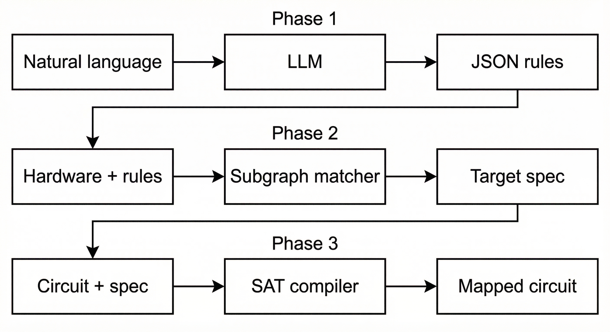

# Conversation to Compilation: LLM-Driven Quantum Compiler Synthesis

## Main Architecture Pipeline

## Abstract

Quantum compilers must map and route logical circuits onto hardware with limited connectivity, while minimizing SWAP overhead that increases depth and error. This is difficult because the search space grows combinatorially and hardware rules are rapidly changing across platforms (new topologies, native multi-qubit gates, and evolving constraints), forcing frequent compiler rewrites and slowing down research iteration. This project addresses that bottleneck with a conversation-to-compilation workflow: natural-language hardware constraints are translated by an LLM into a structured intermediate representation, then compiled into MaxSAT constraints so the existing SAT-based mapping framework can adapt quickly to new rules without hand-rewriting core compiler logic.

## Presentation Slides

[ASPLOS slides](asplos-2026/ASPLOS-slides.pdf)

## NVIDIA Brev Launchable Setup

Set up your environment using NVIDIA Brev with this launchable:

**[Launch on NVIDIA Brev](https://brev.nvidia.com/launchable/deploy?launchableID=env-3AhMy6PJDwlfvNNYggGRa4E4qlY)**

After the launchable finishes provisioning and you are in the environment:

1. Navigate to `LLM-integrated-Quantum-compiler/asplos-2026/tutorial-full-compiler-run.ipynb`.
2. Once the notebook is open in Jupyter, choose **satmapenv** from the kernel / environment list (it may appear as **Python (satmapenv)**).
3. Run all cells.

## References

- **SATMAP project:** [qqq-wisc/satmap](https://github.com/qqq-wisc/satmap)
- **SATMAP paper:** [Qubit Mapping and Routing via MaxSAT (arXiv:2208.13679)](https://arxiv.org/abs/2208.13679)
- **SABRE paper:** [Tackling the Qubit Mapping Problem for NISQ-Era Quantum Devices (arXiv:1809.02573)](https://arxiv.org/abs/1809.02573)
- **Qiskit SABRE pass:** [SabreLayout documentation](https://docs.quantum.ibm.com/api/qiskit/qiskit.transpiler.passes.SabreLayout)
